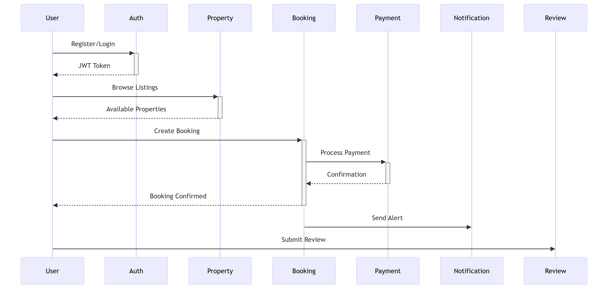

# 🏡 ALX Airbnb Clone – Backend Feature & Function Specification

This document outlines all the essential backend features and functionalities required to support the ALX Airbnb clone project. The system supports multiple user roles (guest, host, admin), property listings, bookings, payments, messaging, and reviews.

---

## 👤 User Management & Authentication

### 🔐 Authentication
- **User registration** with required fields: first name, last name, email, password.
- **Password hashing** using secure methods (e.g., bcrypt or pgcrypto).
- **Login functionality** to validate credentials and issue a session/token.
- **Role-based access control** for:
  - `guest`: can book and review properties.
  - `host`: can create/manage property listings.
  - `admin`: can access/modify all records for moderation or analytics.

### 👤 Profile Features
- View and update personal details (except email).
- Role management (only for admins or system-level scripts).
- View a user’s bookings, messages, and reviews.

---

## 🏘️ Property Management

### 🏠 Host Capabilities
- Create, update, and delete property listings.
- Add detailed description, location, and pricing.
- Automatic `created_at` and `updated_at` timestamps.
- Listings are tied to a valid `host_id` (must be a user with role = 'host').

### 🔎 Public/Guest Access
- Browse available properties by filters (e.g., location, price).
- View individual property pages including:
  - Host details.
  - Reviews and average rating.
  - Pricing and availability calendar.

---

## 📅 Booking System

### ➕ Booking Creation
- Users (role = 'guest') can:
  - Select property, start and end date.
  - View total price.
  - Submit a booking request (status defaults to `pending`).
- Hosts can confirm or cancel bookings.

### 📋 Booking Management
- Each booking maintains:
  - Link to property and user.
  - Start & end dates.
  - Status (`pending`, `confirmed`, `canceled`).
  - Total price.
- Guests can view all their past and current bookings.
- Hosts can view bookings for their properties.

---

## 💳 Payments

### 💰 Payment Processing
- Once a booking is confirmed, guests can initiate payment.
- Supports multiple payment methods: `credit_card`, `paypal`, `stripe`.
- Logs:
  - Amount.
  - Booking reference.
  - Payment method.
  - Timestamp (`payment_date`).

### 📄 Admin Tools
- Admins can:
  - View all payment transactions.
  - Generate reports on revenue by date or property.

---

## ⭐ Reviews & Ratings

### ✍️ Review Features
- Only guests who have booked a property can review it.
- Each review includes:
  - Star rating (1–5).
  - Comment.
  - Timestamp.
- Each property can display:
  - List of reviews.
  - Average rating.
- Users can manage their own reviews.

---

## 💬 Messaging System

### 📩 User Messaging
- Enables communication between guests and hosts.
- Messages include:
  - Sender and recipient IDs.
  - Message body.
  - Timestamp (`sent_at`).
- Display a chat history between two users.
- Notifications or unread message indicators (optional feature).

---

## 🛠️ Admin Features

### 🔍 Moderation & Control
- View and delete inappropriate messages or reviews.
- Manage user roles and permissions.
- Access all data for reporting and oversight.
- Potential for implementing dashboard analytics for:
  - Total users.
  - Active listings.
  - Monthly revenue.
  - Booking trends.

---

## 📌 Technical Notes

- All UUIDs should be generated on the backend (or in PostgreSQL using `gen_random_uuid()`).
- Use of `ENUM` types ensures strict role/status/payment validation.
- Ensure all sensitive operations are protected by appropriate permissions and authentication checks.

---

## ✅ Summary of Key Entities

| Entity     | Features |
|------------|----------|
| `User`     | Roles, secure auth, profile info |
| `Property` | Listings with host links, descriptions, triggers |
| `Booking`  | Reservation flow with status control |
| `Payment`  | Payment tracking, multiple methods |
| `Review`   | Rating and commenting per booking |
| `Message`  | Peer-to-peer chat system |

---

> ✅ This backend structure provides a scalable foundation for a modern Airbnb-style application, with user role separation, transactional integrity, and a modular architecture for future growth.

### 🎨 Designed By  
**Franklin Zyambo**  
*Cloud Architect | Data Analyst | Software Engineer*