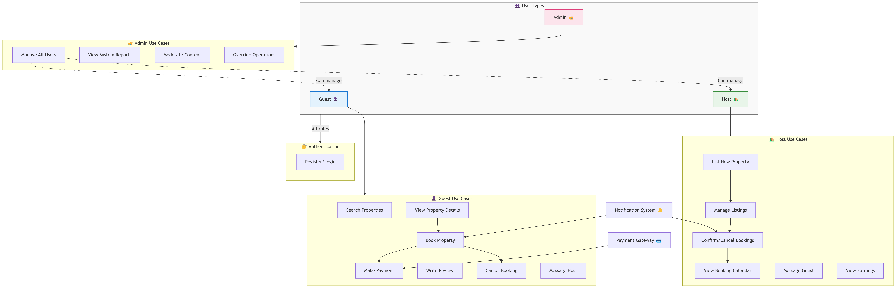

# 🧩 Airbnb Clone – Use Case Diagram

---

## 👥 User Types

| Role   | Description |
|--------|-------------|
| 👤 **Guest** | Can browse and book properties, send messages, and leave reviews. |
| 🏠 **Host** | Can list and manage properties, handle bookings, and interact with guests. |
| 👑 **Admin** | Has access to moderate the system, manage users, and override operations. |

---

## 🔐 Common Use Case

### 🔑 Authentication
- **Register/Login**: Required for all roles (Guest, Host, Admin).

---

## 👤 Guest Use Cases

| Use Case | Description |
|----------|-------------|
| 🔎 Search Properties | Browse available listings using filters. |
| 🏠 View Property Details | View full listing including images, reviews, and availability. |
| 📅 Book Property | Initiate a reservation by selecting dates. |
| 💳 Make Payment | Pay for a confirmed booking via integrated gateway. |
| ❌ Cancel Booking | Cancel an upcoming reservation (subject to rules). |
| 📝 Write Review | Leave feedback and a rating after a stay. |
| 💬 Message Host | Communicate directly with property hosts. |

---

## 🏠 Host Use Cases

| Use Case | Description |
|----------|-------------|
| ➕ List New Property | Add a new listing with details like pricing, location, etc. |
| 🔧 Manage Listings | Edit or delete existing properties. |
| ✅ Confirm/Cancel Bookings | Accept or decline guest booking requests. |
| 🗓️ View Booking Calendar | View all current and upcoming reservations. |
| 💬 Message Guest | Respond to guest inquiries or messages. |
| 💰 View Earnings | Track booking revenue and payment summaries. |

---

## 👑 Admin Use Cases

| Use Case | Description |
|----------|-------------|
| 👥 Manage All Users | Create, delete, or update any user account. |
| 📊 View System Reports | Access platform-wide analytics and data. |
| 🔎 Moderate Content | Remove inappropriate listings, reviews, or messages. |
| 🛠️ Override Operations | Intervene in booking, payment, or listing disputes. |

---

## 🔔 Other Components

| Component | Role |
|-----------|------|
| 🛎️ **Notification System** | Send alerts about booking confirmations, messages, or status changes. |
| 💳 **Payment Gateway** | Integrates payment processing for guests making bookings. |

---

### 🎨 Designed By  
**Franklin Zyambo**  
*Cloud Architect | Data Analyst | Software Engineer*
